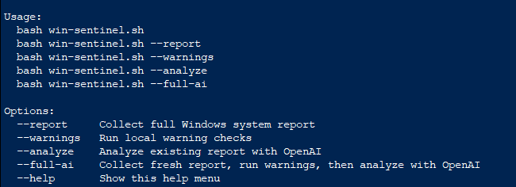
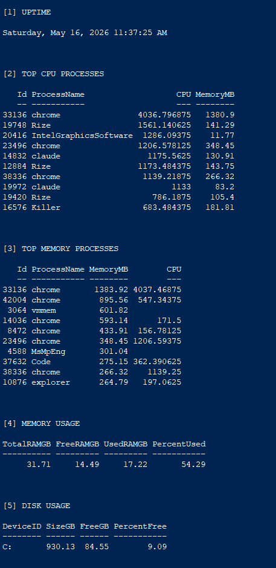
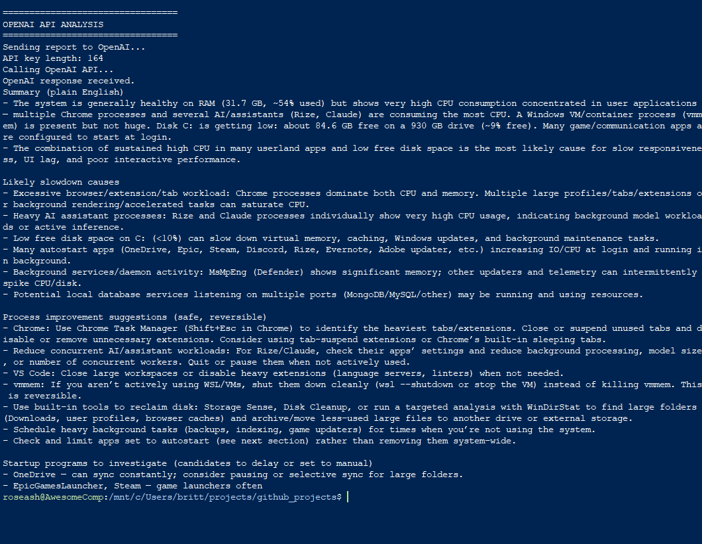

# Win Sentinel

Win Sentinel is a Bash + PowerShell CLI tool for analyzing Windows system performance.

It checks:
- CPU-heavy processes
- memory usage
- disk space
- startup programs
- listening ports
- stopped automatic services
- recent system errors

It can optionally use the OpenAI API to explain system issues in plain English.

## Requirements

- Windows
- PowerShell
- Bash through WSL, Git Bash, or similar
- OpenAI API key for AI analysis (optional)

## Usage

Generate a report:

```bash
bash win-sentinel.sh
```

Analyze existing report with OPENAI:
```bash
export OPENAI_API_KEY="your_key_here"
bash win-sentinel.sh --analyze
```

Generate new report and analyze:
```bash
bash win-sentinel.sh --full-ai
```

## Safety

This tool does not change your system. It reports information and suggests next steps.

Do not upload:

- .env
- API keys
- win-sentinent-report.txt
- personal system logs

## Screenshots:






